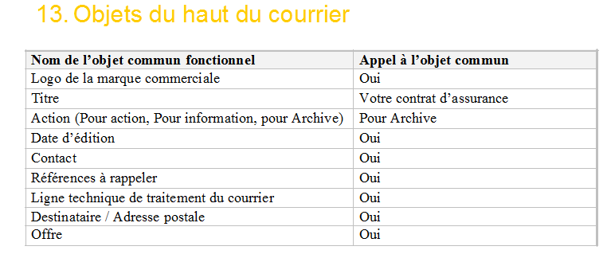
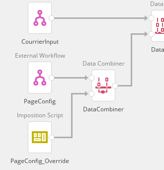

# Procédure d'utilisation de l'enchaînement des pages

Conforme au besoin exprimé par le client l'enchaînement des pages (ou suite de pages), ainsi que la taille et position de FlowArea sont mis en commun. Cette procédure décrit l'appel de ces éléments et la configuration nécessaire pour leur bon fonctionnements lors de leur utilisation par les maquettistes.

## Step 1 : Appel externe de la page Suite_Page1
Appeler l'objet Pages.Suite_Page1 se trouvant dans le fichier *.../WFD/COMMON/PDK_ContentMaster.wfd*.
Pour plus de détail sur cette manipulation voir doc inspire designer chapitre *6 Design Input Modules > 6.3 Layout Module > 6.3.6 Layout Objects > 6.3.6.15 External Objects*.

Une fois terminé vérifier que les éléments suivants sont désormais présent dans la maquette :
- Pages.Suite_Page1
- Pages.Suite_Recto
- Pages.Suite_Verso
- Pages.Suite_BlankVerso
- Data.Flow

## Step 2 : Appel des pages
Dans *Pages > General > Page order*, sélectionner "Variable selection", Type sera laisser en "Simple" et *Start page* prendra la page *Suite_Page1*.
todo screen pages order

## Step 3 : Appel du PageConfig
Afin de remplir la structure Data.Flow on appellera le fichier *.../WFD/COMMON/PageConfig_Default.wfd* dans le cas d'un courrier à un seul flow ou *PagesConfig_LettreAccomp* dans le cas d'un courrier avec lettre d'accompagnement (2 flows).
Ces fichiers seront appelés par un ExternalWorkflow qui sera joint par un module Data Add avant d'être envoyé au layout.

Il est recommandé d'utiliser le template *.../WFD/MODEL/Template.wfd* pour gagné du temps et évité les erreurs.

TODO  screen template

## Step 4 : Vérifier les données du PageConfig
Dans le document de référence de la maquette un tableau apparait en début et fin de chaque "corps de courrier" intitulé respectivement "objets du haut de courrier" et "objet du bas de courrier"

Exemple pour la maquette N091 "objet haut de courrier" pour la lettre d'accompanement.


Il est nécessaire de transcrire les informations fournit par ces taleaux dans les données du PageConfig (référent ici a Data.Flow).
La documentation du ContentMaster, le Chapitre *PageConfig > Définition de la structure*, vous renseignera sur les valeurs par défaut généré par *PageConfig_Default* et *PageConfig_LettreAccomp*.
Comparer chacune des valeurs par défaut, fournit par le module PageConfig choisit, avec les valeurs données par les tableau de haut/bas du courrier.
Si ces valeurs ne correspondent pas il est nécessaire d'écraser cette donnée avec la valeur fournit par le document de référence (voir Step 5). 
Si toutes les valeurs correspondent aux valeur par défaut, Step 5 peut être ignoré.

## Step 5 : Écraser les données par défaut du PageConfig
Toujours dans l'objectif de maintenir plus facilement les maquettes, on gardera un module PageConfig commun à plusieurs maquettes générant des valeurs par défauts auquel seront écrasé par un module Data Combiner et un Script Input ou Script d'imposition comme suit :



On définira alors les valeurs qu'il est nécessaire d'écrasé dans le nouveau script.
Exemple :
```
 // Lettre accomp - logo cacher
Flow.Visibility.Logo = false;
Flow.commit();

// Adhesion - lgoo et offre cacher
Flow.Visibility.Logo = false;
Flow.Visibility.Offre = false;
Flow.commit();
```

Il est recommandé d'écraser le moins de valeurs possible.
